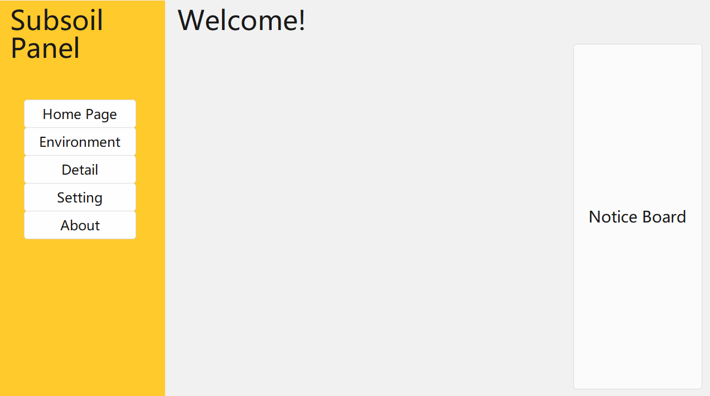

# Subsoil
<br>
- 轻量级Python环境安装/管理器<br>
- 本项目是为[Tower GPT](https://github.com/midway2333/tower_gpt)开发/推理的所设计的环境项目<br>

## 特性
- **一键部署**：快速安装嵌入式Python 3.11环境
- **依赖管理**：支持预置/自定义库的安装
- **多语言支持**：中英文界面自由切换
- **主题切换**：浅色/深色模式切换
- **环境隔离**：独立`sub_env`目录管理Python环境
- **可视化操作**：GUI界面直观展示环境状态
- **镜像加速**：支持阿里云镜像源与清华pip源加速下载


## 系统要求
- Windows 10/11 系统
- 对硬件配置基本没要求

## 下载
- 前往本项目Releases下载
- 使用[蓝奏云](https://wwsq.lanzoue.com/i6Tzy2m2mq2h)下载

## 源码说明
### 核心模块架构
```bash
subsoil/
├── subsoil_panel.py    # 主界面逻辑 (Tkinter/tkinkertools实现)
├── def_box.py          # 功能实现模块
├── about.py            # 关于页面Markdown内容
├── lang.py             # 多语言配置文件
├── sub_config.json     # 用户配置存储 (语言/主题)
└── mcb.icon            # 项目icon
```

## 开发环境要求 ⚙️

### 核心依赖库
```bash
git clone https://github.com/Xiaokang2022/maliang.git
cd tkintertools
# 基础GUI框架 (需从源码安装)

git checkout 3.0.0rc6
# 切换版本

pip install tkhtmlview==0.1.5.2      # HTML渲染组件
pip install markdown==3.6            # Markdown解析
pip install requests==2.32.3         # 网络请求库
```
更好的方法是直接使用subsoil安装开发版本套件再clone`tkintertools(maliang)`<br>
~~完美的生态闭环~~

## 常见问题

### 安装问题
- **Q**: Python安装卡在最后一步？  
  **A**: `get-pip.py`需要直连下载，请耐心等待

- **Q**: 安装时报权限错误？  
  **A**: 请以管理员身份运行CMD/Powershell

### 界面问题
- **Q**: 页面元素错位？  
  **A**: 避免快速切换页面/缩放窗口，重启程序即可恢复

- **Q**: 切换语言无效？  
  **A**: 需点击「应用」按钮后重启程序

## 协议与贡献 📜

### 源代码
- **许可证**: [CC0](https://creativecommons.org/public-domain/cc0/)
- **您可以**：
  - 自由地复制、修改、分发和执行作品
  - 无需署名，无需保留版权声明

### 打包文件与文档
- **许可证**: [CC BY-NC-SA 4.0](https://creativecommons.org/licenses/by-nc-sa/4.0)
- **您可以**：
  - 共享：复制和重新分发材料
  - 改编：修改、转换和基于材料创作

- **限制条件**：
  - 署名：必须注明原作者并提供许可链接
  - 非商业性使用：不得将材料用于商业目的
  - 相同方式共享：如果修改或基于材料创作，必须以相同许可发布

### 问题与贡献
- **问题反馈**: [提交Issue](https://github.com/midway2333/subsoil/issues)

## 注意事项
- **源码与打包文件的区别**：
  - 源码部分（如 `.py` 文件）完全自由，适用 **CC0**
  - 打包文件（如 `.exe`、`.zip`）和文档（如 `.md`、`.png`）适用 **CC BY-NC-SA 4.0**
- **衍生作品**：
  - 基于源码的衍生作品可以自由选择许可协议
  - 基于打包文件或文档的衍生作品必须遵循 **CC BY-NC-SA 4.0**
